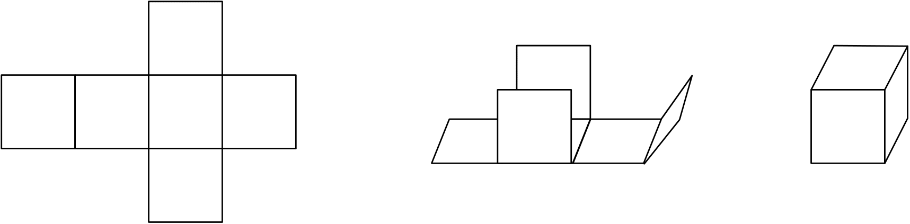

# Folding a Cube

It is well known that a set of six unit squares that are attached together in a “cross” can be folded into a cube.

But what about other initial shapes? That is, given six unit squares that are attached together along some of their sides, can we form a unit cube by folding this arrangement?

## Input

Input consists of **6** lines each containing **6** characters, describing the initial arrangement of unit squares. Each character is either a ., meaning it is empty, or a # meaning it is a unit square.

There are precisely **6** occurrences of # indicating the unit squares. These form a connected component, meaning it is possible to reach any # from any other # without touching a . by making only horizontal and vertical movements. Furthermore, there is no **2 X 2** subsquare consisting of only #. That is, the pattern

<pre>##
##
</pre>

does not appear in the input.

## Output

If you can fold the unit squares into a cube, display can fold. Otherwise display cannot fold.

<table class="sample" summary="sample data">

<tbody>

<tr>

<th>Sample Input 1</th>

<th>Sample Output 1</th>

</tr>

<tr>

<td>

<pre>......
......
######
......
......
......
</pre>

</td>

<td>

<pre>cannot fold
</pre>

</td>

</tr>

</tbody>

</table>

<table class="sample" summary="sample data">

<tbody>

<tr>

<th>Sample Input 2</th>

<th>Sample Output 2</th>

</tr>

<tr>

<td>

<pre>......
#.....
####..
#.....
......
......
</pre>

</td>

<td>

<pre>can fold
</pre>

</td>

</tr>

</tbody>

</table>

<table class="sample" summary="sample data">

<tbody>

<tr>

<th>Sample Input 3</th>

<th>Sample Output 3</th>

</tr>

<tr>

<td>

<pre>..##..
...#..
..##..
...#..
......
......
</pre>

</td>

<td>

<pre>cannot fold
</pre>

</td>

</tr>

</tbody>

</table>

<table class="sample" summary="sample data">

<tbody>

<tr>

<th>Sample Input 4</th>

<th>Sample Output 4</th>

</tr>

<tr>

<td>

<pre>......
...#..
...#..
..###.
..#...
......
</pre>

</td>

<td>

<pre>can fold
</pre>

</td>

</tr>

</tbody>

</table>

